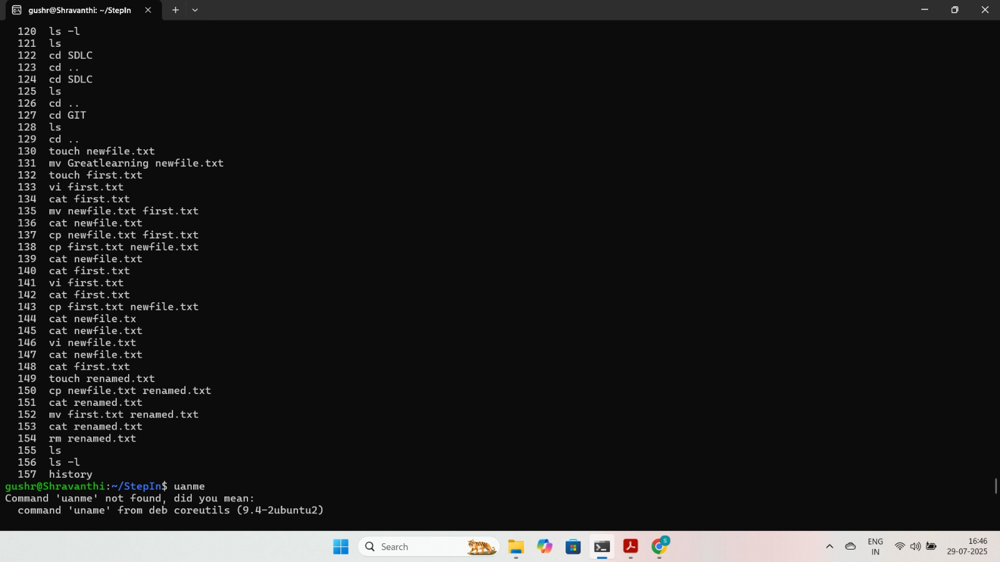
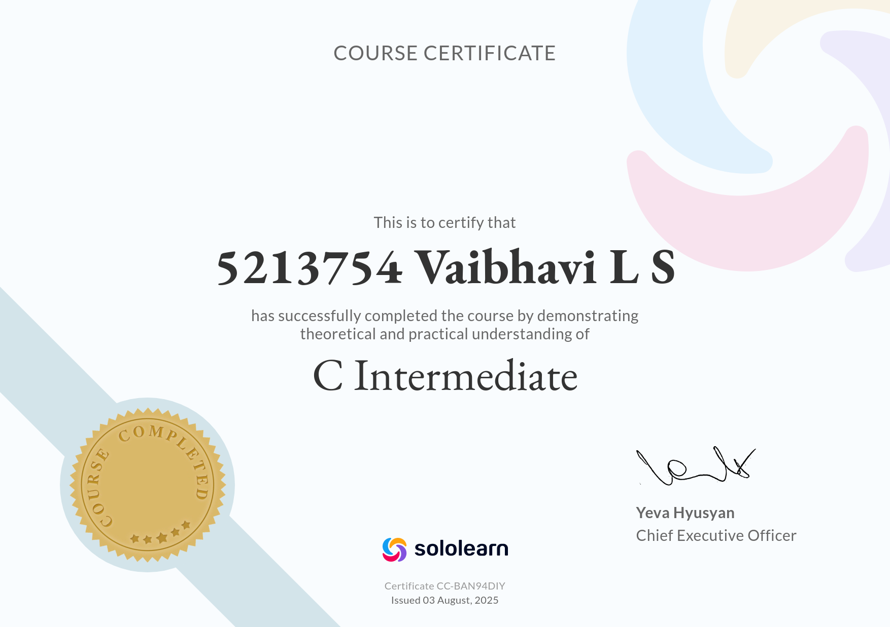

5213754_Vaibhavi_LS

## Agile Quiz Result  

--------------------------------------------------------

## Git Folder Contents

### Certificate

------------------------

### Assignments

- [assignment_1.txt](git/assignments/assignment_1.txt)
- [assignment_2.txt](git/assignments/assignment_2.txt)
- [assignment_3.txt](git/assignments/assignment_3.txt)
- [assignment_4.txt](git/assignments/assignment_4.txt)
- [assignment_5.txt](git/assignments/assignment_5.txt)
- [Project.txt](git/assignments/Project.txt)

--------------------------------------------------------------------

## Linux commands screenshots  

----------------------------------------------------------------------
## Sololearn certificates 

-----------------------------------------------------------------------------------------
## Hackerrank problem statements

-[Min_Max_Sum](hackerrank_problem_statements/week_1/Min_Max_Sum.c.txt)
-[Plus_Minus](hackerrank_problem_statements/week_1/Plus_Minus.c.txt)
-[Sparse_arrays](hackerrank_problem_statements/week_1/Sparse_arrays.c.txt)
-[Time_conversion](hackerrank_problem_statements/week_1/Time_conversion.c.txt)
-[Lonely_integer](hackerrank_problem_statements/week_1/Lonely_integer.c.txt)
-[Flipping_bits](hackerrank_problem_statements/week_1/Flipping_bits.c.txt)
-[Diagonal_difference](hackerrank_problem_statements/week_1/Diagonal_difference.c.txt)
-[Counting_sort1](hackerrank_problem_statements/week_1/Counting_sort1.c.txt)
-[Pangrams](hackerrank_problem_statements/week_1/Pangrams.c.txt)
